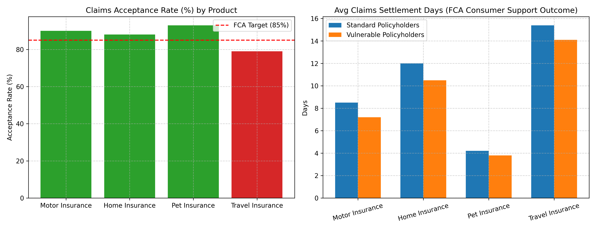

# FCA Consumer Duty & Fair Value MI Dashboard

A regulatory Management Information (MI) analytics framework and business analysis specification aligned with the UK Financial Conduct Authority (FCA) Consumer Duty regulations (FG22/5).

---

## 🏛️ Regulatory Context & Executive Summary

The FCA Consumer Duty requires UK insurance firms to act to deliver good outcomes for retail customers across four key areas: Products & Services, Price & Value, Consumer Understanding, and Consumer Support.

This project delivers:
- **Fair Value & Outcome Analytics:** Monitoring Claims Acceptance Ratios, Complaints per 1,000 policies, and Product Fair Value Scores across Motor, Home, Pet, and Travel insurance portfolios.
- **Vulnerable Customer SLA Tracking:** Monitoring settlement turnaround times comparing vulnerable vs. standard policyholders.
- **Automated RAG Status Generator:** Evaluates compliance against FCA thresholds and flags product lines needing governance remediation.
- **Formal BA Artefacts:** Complete **[Business Requirements Document (BRD)](docs/BRD.md)** detailing regulatory outcome definitions and metrics specifications.

---

## 📊 Summary Results & Executive MI

| Product Line | Active Policies | Claims Acceptance (%) | Acceptance RAG | Complaints per 1k | Complaints RAG | Fair Value Score (out of 10) |
|---|---|---|---|---|---|---|
| **Pet Insurance** | 22,000 | **93.0%** | 🟢 GREEN | **2.00** | 🟢 GREEN | **8.9** |
| **Motor Insurance** | 45,000 | **90.0%** | 🟢 GREEN | **3.11** | 🟡 AMBER | **8.4** |
| **Home Insurance** | 38,000 | **88.0%** | 🟢 GREEN | **2.50** | 🟢 GREEN | **8.1** |
| **Travel Insurance** | 15,000 | **79.0%** | 🔴 RED | **5.47** | 🔴 RED | **7.2** |

*Travel Insurance is flagged in RED due to low claims acceptance (79%) and elevated complaint rates (5.47/1k), triggering a mandatory Product Governance & Fair Value Review under FCA rules.*

---

## 📈 MI Visualizations



---

## 🚀 How to Run

```bash
git clone https://github.com/sach98/fca-consumer-duty-mi-dashboard.git
cd fca-consumer-duty-mi-dashboard
python3 src/generate_mi_report.py
```
*Generates `outputs/consumer_duty_mi_summary.csv` and `outputs/consumer_duty_mi_summary.png`.*

---

## 📜 Regulatory Artifacts
- **[docs/BRD.md](docs/BRD.md)** — FCA Consumer Duty Four Outcomes Business Requirements Document.
